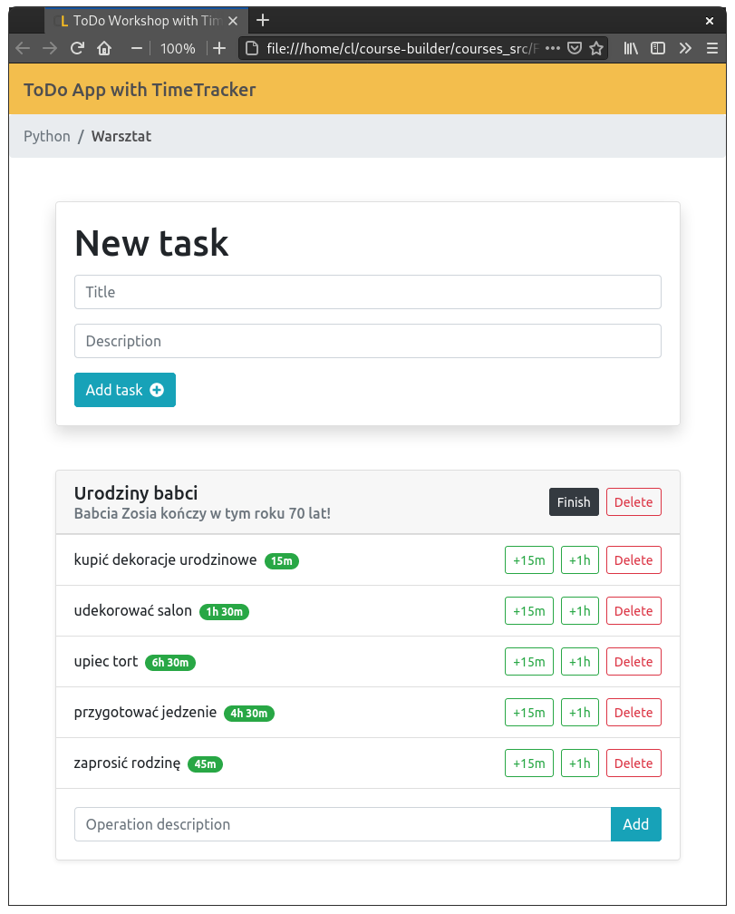

# time-management-app

## About the application
In this workshop, you will write a time management app. The application will allow you to add tasks (each task has a title and description), and add detailed operations needed to complete the task.

A task could be "Grandma's birthday", with the description "Grandma Harriet turns 70 this year!". The operations would be:

    buy birthday decorations
    decorate the living room
    bake a cake
    prepare the food
    invite the family

Clicking on the "+15m" or "+1h" buttons will add time to a counter that is available for each operation. Thanks to this, after the birthday you will know that baking a cake takes "6h 30m" and inviting the family "45m".

When the task is completed, you can mark it as finished by clicking "Finish". The finished task is read-only - you won't add any more operations or time to the current ones. They cannot be deleted either.

Tasks can be deleted at any time.

## API - what is it?

The application will store tasks on the server, and we will communicate with it through its API (Application Programming Interface). Surely you know what GUI (Graphical User Interface) is - it is an interface that an application presents to a human so that he can communicate with it. Data made available to a human are clearly formatted, with appropriate fragments highlighted, and links and buttons are used for interaction. People love working with GUI, but programs don't need all these decorations - programs want pure data, in the simplest form possible, with clear rules for retrieving and changing it. Since GUI is for people, we need a separate interface for applications.

An API is an interface that allows an application (such as the Timetracker running in a browser) to communicate with another application (such as a server that remembers tasks, operations and their times). Communication means that the application (the one in the browser) makes a request (fetch) to a specific address on the server (e.g. https://my-api.com/api/tasks) with an appropriate method (e.g. GET when it comes only to reading data), and in response the server returns the data in the specified format (e.g. JSON).

The data themselves have a strictly defined structure: in the case of your backend, in response to a task list request the server will return an object that has keys error and data, has the value true or false saying whether the query succeeded placed under the key error, and has an array of objects under key data, etc.

The API also allows you to make changes - then instead of the GET method use another (POST, PUT, DELETE, etc.). You may also attach additional data to the query itself (e.g., when creating a task, you need to execute the query using POST to https://my-api.com/api/tasks, and additionally give a title and a description).
Every application has a different API

Different servers have different APIs, and each API needs to be learned from scratch: different addresses and data structures are found on a stock trading server, different on a server that books hotel rooms, and different on a server of a company that collects health data to suggest exercises and diets. Fortunately, there are some common elements (e.g. using JSON to transfer data and GET to read them) that make it easier to start working with each of them.
REST API

## The API that we will use in this task can be called a REST API. What does that mean?

To be able to say that an API is RESTful, it must meet several criteria. The most important of them are:

    Separation of the GUI from the server - the server does not return ready-made pieces of HTML that the frontend would insert into the page. The server returns "raw" data (e.g. in the JSON format), and the frontend has full freedom as to what it is going to do with it.
    Every query should contain all information that the server needs to execute it.
    Addresses must have a clear structure, and must unambiguously indicate which resource they refer to (i.e. all tasks, one particular task, all operations in the task, one specific operation - each of these resources has its own separate address).

In addition to returning the content of the response, the server also returns its code. You surely know that 404 means "not found". The server will return a response with such a code if the application asks it e.g. for a task with a number that does not exist: https://my-api.com/api/tasks/1000000500100900
Response codes

**The codes you may encounter in this workshop are**:

* 200 - OK
* 201 - Created (A resource, i.e. task or operation, was successfully created)
* 204 - No Content (query succeeded, but there is nothing to return - the query could have asked e.g. to delete the task or operation)
* 400 - Bad Request (either the Content-Type header is missing, or the title/description of the task being created is missing, or something else is wrong with the request itself)
* 403 - Forbidden (probably missing header Authorization - more on that in the next article)
* 404 - Not Found (task or operation does not exist)

## Summary

The main goal of this workshop is to work with an API: you will write an application that does not have data in its code, and instead must rely on communication with the server.

In doing so, we will practice working with Fetch API and modifying an already existing DOM tree.

The frontend is limited here to presenting data stored on the server and giving commands to the server. The role of the backend is to serve data in JSON format to anyone who asks for it, and to change that data when it is requested.
